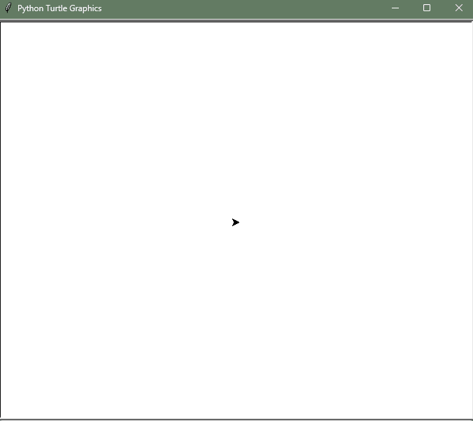

# 100 days of Python
---

Well this is just my advance about the Udemy online course.
[Course Link](https://www.udemy.com/course/100-days-of-code/)

## How to run the files
---
- Like any other repo you'll have to clone first or download or whatever, just make sure to have it in your local machine.
- Then open the repo source folder in your terminal.
- And just like any other .py file. If you have installed python just run the `python` command plus the name of the file. *`python sample.py`*. And that's it

Of course if you don't have python installed just follow the instructions in this link
[Python downloads](https://wiki.python.org/moin/BeginnersGuide/Download).

And ... You got it.

## Projects solutions
I'm going to add each solution to the different projects by day because I was
very confused about the solution code in the course. I finally found where to get it.

So I will place a **solution** folder inside each day to have a more accurate overview of the projects assigned by the instructor and how they are originally supposed to work.

Finally, this solutions will be added up to day 15 which is when the beginner part
of the course ends. After that day (from 16th until the final day) the repository should contain only my own code.

## A personal note
---
I'm really happy to share this advance with you. I know is not a great repo and any of this code isn't like a pro level but it's something, is my advance and I like so much code this for my self, for you, or for any others learners who are seeking some useful code and logic. I know as well now there is IA you really don't need this but remember the base of knowledge of that models are this. The code of ourselves. Have a good day and code fun.

## Some demos
---
### Spirograph
An spirograph demo made on 18th day section using Turtle Graphics.

  

